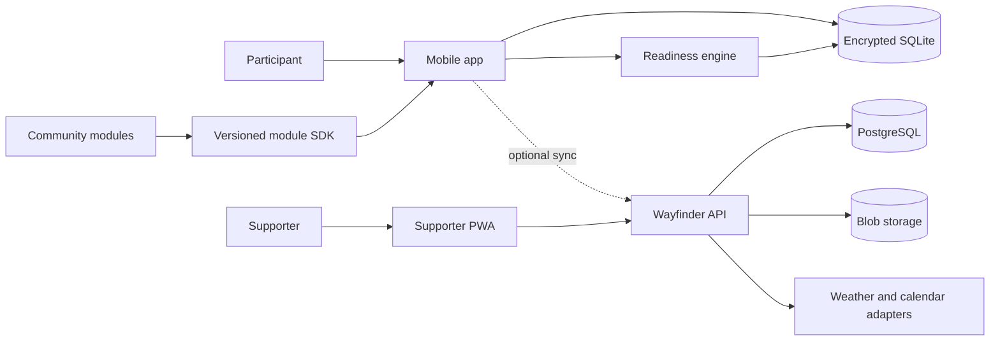
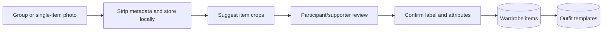
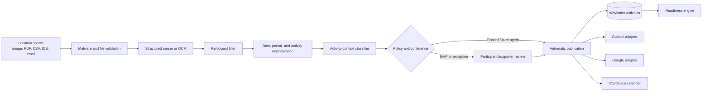
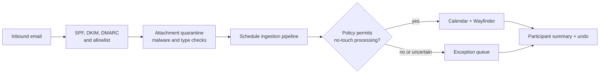
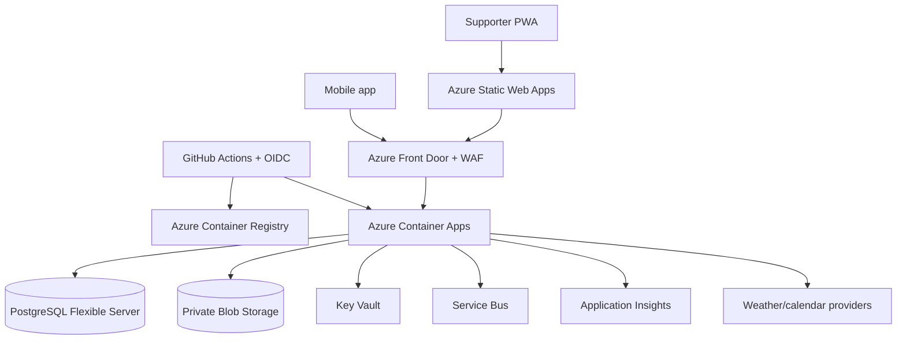

# Solution Architecture

## Architectural style

Use an **offline-capable modular monolith** with framework-free domain packages. The mobile application owns the critical morning path. Cloud services add synchronization and integrations but are not required for daily use.

This avoids both failure extremes:

- a cloud-only app that becomes unusable during an outage; and
- premature microservices or plug-in complexity that slows a small team and fragments accessibility.

## Bounded modules

| Module | Responsibility | MVP |
| --- | --- | --- |
| Identity and consent | Local profile, account linking, support-circle grants | Yes |
| Accessibility profile | Presentation, language, sensory, prompt, and input preferences | Yes |
| Activities | Manual and imported schedule items | Yes |
| Schedule ingestion | File extraction, participant filtering, review, and provenance | Yes |
| Calendar publication | Outlook, Google, device-calendar, and ICS adapters | Optional alpha |
| Weather | Normalized forecast and freshness | Yes |
| Wardrobe | Items, images, attributes, availability, laundry | Yes |
| Readiness engine | Explainable plan generation | Yes |
| Plan experience | Today view, completion, swaps, feedback, help | Yes |
| Sync | Change log, device cursors, conflict handling | Optional alpha |
| Module runtime | Manifest, permissions, lifecycle, versioning | Contracts only |

Dependencies point inward: UI and adapters depend on domain contracts; domain code never imports React Native, Azure, database, or provider SDKs.

## Recommended technology stack

| Layer | Recommendation | Why |
| --- | --- | --- |
| Language | TypeScript, strict mode | Shared contracts and contributor familiarity |
| Mobile | React Native with Expo and Expo Router | Android/iOS reach, accessible native controls, rapid iteration |
| Supporter web | React with Vite or Expo Web; PWA | Reuse design tokens while preserving web semantics |
| UI | React Native primitives plus a small Wayfinder design system | Avoid inaccessible widget-heavy frameworks |
| Local data | `expo-sqlite`, SQL migrations, platform keystore for keys | Durable offline storage without a proprietary runtime |
| Validation | Zod plus generated JSON Schema/OpenAPI | One contract across app, API, fixtures, and docs |
| Domain tests | Vitest; property tests for readiness rules | Fast deterministic testing |
| Mobile tests | React Native Testing Library; Maestro for critical flows | Semantics and end-to-end behavior |
| Web tests | Testing Library; Playwright plus axe-core | Keyboard, browser, and accessibility coverage |
| API | Node.js LTS with Fastify | Small, typed, OpenAPI-friendly service |
| Cloud data | Azure Database for PostgreSQL Flexible Server | Relational integrity, JSON where justified, open portability |
| Images | Azure Blob Storage | Inexpensive object storage with lifecycle policies |
| Infrastructure | Bicep, Azure Developer CLI, GitHub Actions with OIDC | Reproducible, keyless deployment |
| Observability | OpenTelemetry and Application Insights | Vendor-neutral instrumentation with Azure backend |

Pin supported versions in the repository and update through an automated, reviewed dependency process. Prefer boring, widely supported components over novel local-first frameworks until sync requirements prove the need.

## API design

The optional cloud API is contract-first and documented in [OpenAPI 3.1](../../openapi/wayfinder-v1.yaml).

- Use resource-oriented HTTPS endpoints with JSON payloads and `application/problem+json` errors.
- Require an idempotency key for every mutation and operation IDs for synchronization.
- Authorize every request against participant, relationship, capability, purpose, and grant status.
- Use opaque UUID identifiers; never expose sequential participant IDs.
- Paginate collection and synchronization responses with stable cursors.
- Apply explicit size, count, and date-window limits.
- Version breaking changes in the URL and publish schema migration periods.
- Do not return a resource's existence when the actor is unauthorized.
- Include user-safe error text, a stable machine code, and a correlation ID with no personal data.
- Keep readiness generation local. A plan endpoint supports authorized sharing and multi-device access; it is not required to start the day.

## Local-first architecture

### Data ownership

- The device database is authoritative for local actions.
- Every mutation writes domain state and an append-only `SyncOperation` in one SQLite transaction.
- The user can operate indefinitely without creating a cloud account.
- Cloud sync is explicit, optional, and scoped by consent.
- Local export uses a documented, portable package format.

### Synchronization model

1. Client creates an operation with a UUIDv7 identifier, device ID, entity version, timestamp, and payload hash.
2. API authenticates the device and checks the participant's consent scope.
3. Server applies idempotently and returns a monotonic server cursor.
4. Client pulls operations after its cursor and applies them transactionally.
5. Simple scalar conflicts use field-level last-write-wins with server-recorded provenance.
6. Deletions use tombstones until every active device acknowledges them.
7. High-impact conflicts never auto-merge: supporter permissions, consent, accessibility settings, and participant identity require user review.

Do not synchronize raw telemetry with personal records. Do not upload wardrobe images until image sync is separately enabled.

## Readiness engine

The MVP engine is deterministic and explainable.

### Inputs

- local date and time;
- normalized current conditions and forecast windows;
- selected plan date and coarse forecast area;
- activities, locations, mobility expectations, and dress requirements;
- normalized activity contexts such as active walking, exercise, water, indoor seated, and extended outdoor time;
- wardrobe availability and item attributes;
- default routine items and schedule-specific item exceptions;
- sensory and presentation preferences;
- user-approved outfit templates;
- explicit supporter notes, special items, and routine-item exceptions.

### Pipeline

1. Validate inputs and label missing or stale data.
2. Derive day facts: current and apparent temperature, relevant outdoor-window minimum/maximum, precipitation windows, wind, activity transitions, exposure duration, and travel buffers.
3. Build constraints: available, sensory-safe, weather-suitable, activity-suitable.
4. Rank valid outfit templates/items using stable user-defined preferences.
5. Aggregate special items, remove default routine items, and preserve routine-item exceptions such as "no lunch box."
6. Generate plain-language explanations from controlled templates.
7. Persist the plan and its input snapshot so it is reproducible.

The engine returns alternatives and uncertainty; it does not fabricate missing facts. The same inputs and ruleset version produce the same plan.

Temperature bands select a draft starting layer set. Rain, wind, snow/ice, exposure duration, activity intensity, and indoor/outdoor transitions modify it. Hard sensory and availability constraints apply before ranking. Near a band boundary or when comfort evidence is incomplete, return two valid choices rather than hiding a brittle threshold decision.

Outfits must always be computed from the day's facts. A recommendation must never be stored against a calendar date, because a stored outfit will contradict the forecast as soon as the weather changes. The band is selected from the expected daytime high for outdoor activity, not from the overnight low.

When a needed fact is missing, the engine may apply a documented proxy rather than inventing the fact or ignoring the need. A proxy must be stated in the explanation, must express a general pattern rather than a specific claim, must fail toward mild discomfort rather than harm, and must be replaced permanently once real evidence is recorded. Where two exposures conflict, the engine prefers a single outfit that satisfies both over adding an item the participant has to carry, remove, and remember.

For preview days, the weather adapter fetches a public daily forecast by coarse area and selected date. Forecast failure, provider-window limits, and stale data are visible states. The engine can still provide activity-based clothing guidance, but it must not show guessed Low/High values.

## Wardrobe capture ingestion

Wardrobe capture is progressive rather than all-or-nothing. The MVP supports a low-friction inventory pass where a participant or supporter captures group photos by category, then reviews suggested cropped item cards. Individual photos are a refinement path, not a setup prerequisite.

The classifier may assist with crop, category, warmth, and duplicate suggestions, but the confirmed item card is the source of truth. Unknown attributes remain explicit and block only recommendations that depend on them.

## Weekly schedule ingestion

The schedule ingestion pipeline is a provider-neutral anti-corruption layer between location documents and Wayfinder activities.

### Import rules

- Prefer ICS, CSV, and XLSX over OCR when the location can provide structured data.
- The parser may suggest fields; only deterministic validation decides whether an item can auto-publish.
- Match participants using a location-specific identifier or explicit approved aliases. Never infer identity from similarity alone.
- Discard non-participant rows as soon as filtering completes.
- Represent imprecise time as `morning`, `afternoon`, `evening`, or `fullDay` plus an optional location-specific time range.
- Fingerprint source, participant, local date, period, and normalized title for duplicate detection.
- Store field-level confidence and provenance for every extracted value.
- Classify activity context through versioned rules. `unknown` is a valid result.

### Calendar adapters

Expose one internal `CalendarPublisher` contract with Outlook/Microsoft Graph, Google Calendar, device calendar, and ICS implementations. Adapters support create, update, cancel, and reconcile by external event ID. OAuth grants use minimum calendar scopes and are stored independently from Wayfinder sync consent.

Publishing follows an outbox pattern:

1. save the approved activity and publication intent locally;
2. write to the destination using an idempotency key;
3. persist the destination event ID and version;
4. retry transient failures without duplicating events; and
5. surface permanent failures without removing the local activity.

### Future inbound Scheduling Agent

The inbound agent is an optional automation plane, not an email chatbot. It accepts mail only at opaque participant-specific addresses and evaluates an explicit `ScheduleAutomationPolicy`.

Automatic processing requires a trusted sender, known format, unambiguous participant match, resolved date/period, sufficient field confidence, and participant authorization for the specific destination and change type. Format drift, unexpected deletions, authentication failures, or ambiguity go to an exception queue. The participant can pause or revoke the policy immediately.

## Azure reference architecture

### Environment guidance

- Separate development, test, and production subscriptions or resource groups with distinct identities.
- Use private endpoints for PostgreSQL, Blob Storage, and Key Vault in production.
- Use managed identities; do not store cloud credentials in GitHub or application configuration.
- Put public APIs behind Front Door WAF with rate limits and bot protection.
- Use Container Apps minimum replicas of zero for non-production; production capacity follows measured demand.
- Use zone-redundant services only when reliability requirements justify cost.
- Configure immutable backups, restore drills, resource locks, budgets, and cost alerts.
- Keep provider adapters portable so a self-hosted deployment can replace Azure services.

### Deployment profiles

| Profile | Components | Audience |
| --- | --- | --- |
| Device-only | Mobile app, encrypted SQLite, weather adapter | Maximum privacy and low cost |
| Hosted community | Mobile/PWA, shared Wayfinder cloud | General public |
| Self-hosted | Containers, PostgreSQL, S3-compatible storage | Organizations and sovereign deployments |

## Mobile strategy

1. Ship Android and iOS from one codebase; treat Android low-end devices as a first-class performance target.
2. Optimize first meaningful plan render for under two seconds from local storage.
3. Use native semantic controls, dynamic type, VoiceOver/TalkBack, switch access, and platform reduced-motion settings.
4. Support tablet layouts without creating a separate interaction model.
5. Make notifications optional, quiet by default, and actionable. Never use guilt, urgency inflation, or streak loss.
6. Keep the Today screen available without authentication once the device is locally unlocked.
7. Use app links for supporter invitations, but require an in-app consent confirmation.

## AI strategy

AI reduces setup work; it does not decide a person's life.

### Appropriate uses

- Suggest clothing category, color, warmth, and rain suitability from a photo.
- Suggest duplicate wardrobe attributes for confirmation.
- Offer controlled-language rewrites of supporter notes.
- Detect missing attributes that block a recommendation.

### Architecture

- Prefer on-device inference for common clothing classification.
- Make cloud vision a separate opt-in with a clear image-use notice.
- Send the cropped clothing image only, strip metadata, and delete transient inference copies.
- Return labels with confidence and model version; require confirmation before saving.
- Keep inference behind a provider-neutral `WardrobeClassifier` interface.
- Evaluate accuracy across skin tones, backgrounds, adaptive clothing, cultural dress, and low-cost cameras.

### Prohibited uses

- Emotion, distress, diagnosis, compliance, or "behavior" inference.
- Facial recognition, ambient audio, continuous camera, or location surveillance.
- Open-ended generated morning plans with no deterministic validation.
- Training models on user content without separate, explicit, revocable consent.
- Ranking people, supporters, or independence.

## Extensibility and plug-ins

Design module boundaries now; defer third-party code execution.

A future module manifest declares:

- stable module ID and semantic version;
- compatible Wayfinder API range;
- requested capabilities and data scopes;
- offline behavior;
- accessibility conformance report;
- locale/content packages;
- migrations and uninstall behavior;
- maintainer and security contact.

Modules communicate through typed domain events and narrow capability APIs. They cannot query another module's database tables. Public registry admission requires signed artifacts, reproducible builds, dependency review, accessibility evidence, privacy labels, and human review.

## Reliability and graceful degradation

| Failure | Required behavior |
| --- | --- |
| No network | Show locally generated plan and cached weather age |
| Weather unavailable | Show saved conditions as stale; omit unsupported advice |
| Calendar denied | Use manual activities without repeated permission prompts |
| AI unavailable | Offer manual clothing categorization |
| Sync conflict | Preserve local work and request review for high-impact settings |
| Wardrobe has no valid item | Explain why and show user-approved fallback options |
| Supporter account unavailable | Participant's local plan remains usable |

## Architectural decision gates

Before introducing a service, database, AI model, or runtime extension, require evidence that it:

1. materially improves the independence outcome;
2. cannot be handled by the current modular monolith;
3. has an accessible failure mode;
4. preserves device-only use; and
5. has an affordable operating and maintenance path.
