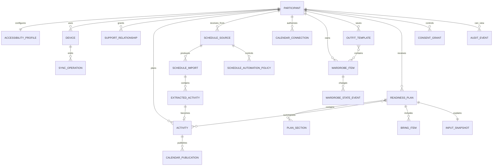

# Data Model

## Ownership rules

- `Participant` owns their profile, plan, wardrobe, activities, and consent.
- A `SupportRelationship` delegates capabilities; it does not transfer ownership.
- Every supporter mutation records actor, source, time, and affected fields.
- Images are separate objects with independent retention and sync consent.
- Sensitive free text is minimized. Structured attributes are preferred.

## Core entity model

## Entity catalog

### Participant

`id`, preferred name, locale, timezone, unit system, local-only/account-linked state, created/updated timestamps.

Do not store diagnosis as a required or default field. Functional preferences belong in the accessibility profile.

### AccessibilityProfile

`participantId`, reading level, text scale, information density, icon mode, photo mode, contrast theme, reduced motion, audio preference, input method, prompt level, transition warning, confirmation style, color-use preference.

### SupportRelationship

`id`, participant ID, supporter ID, status, granted capabilities, start/end, last reviewed, created by participant, revoked timestamp.

Capability examples: `activity.read`, `activity.write`, `wardrobe.read`, `wardrobe.state.write`, `plan.read`, `note.write`. Consent and accessibility writes are never delegable in the MVP.

### Activity

`id`, participant ID, source, external source ID, title, controlled description, start/end, time precision (`exact`, `period`, `dateOnly`), period, all-day, location label, preparation minutes, bring-items, clothing requirements, activity contexts, sensory notes, status, provenance.

### ScheduleSource

Represents a location or program that supplies schedules: `id`, participant ID, display name, approved participant aliases or opaque source identifier, timezone, period mappings, accepted formats, and source status.

### ScheduleImport

One received document or message: `id`, source ID, participant ID, channel (`upload`, `email`, `calendarFeed`), source fingerprint, received time, parser version, status, original retention expiry, field-confidence summary, review actor/time, and publication result.

The original source can contain other people's information. Store it only in a short-lived encrypted quarantine and delete it after participant filtering and the configured recovery period.

### ExtractedActivity

Candidate before publication: `id`, import ID, local date, exact start/end or period, raw title fragment, normalized title, location, participant-match evidence, activity contexts, bring-items, field-level confidence, provenance coordinates, review state, and linked activity ID.

### CalendarConnection

`id`, participant ID, provider (`outlook`, `google`, `device`, `ics`), calendar ID/label, authorization status, granted scopes, token reference, preferred flag, last successful use, and revoked time. Tokens are secrets stored outside the domain database.

### CalendarPublication

`id`, activity ID, connection ID, destination event ID, published version, idempotency key, status, last attempt, failure code, and cancellation time.

### ScheduleAutomationPolicy

Future inbound-agent authorization: `id`, participant ID, schedule source ID, opaque inbound address ID, trusted sender rules, expected format version, participant match rule, allowed destinations, permitted actions (`create`, `update`, `cancel`), confidence thresholds, notification preference, status, last reviewed, and revoked time.

### WardrobeItem

`id`, participant ID, local image reference, optional synced object reference, category, layer, warmth, rain suitability, activity suitability, fabric materials, whether the garment touches skin, tag status (`unknown`, `present`, `removed`, `tagless`), sensory tags, color label, user label, favorite, classifier suggestion metadata, archived timestamp.

Fabric-contact and tag-status requirements can be configured as hard constraints. A hard constraint excludes an item before outfit ranking; it is not a preference that a higher score can override.

### WardrobeStateEvent

Append-only event: `itemId`, state (`available`, `laundry`, `wet`, `damaged`, `unavailable`), effective time, actor, note. Current state is a projection.

### OutfitTemplate

`id`, participant ID, name, item IDs, applicable weather bands, applicable activity types, sensory context, preference rank, last accepted.

### WeatherSnapshot

`id`, geospatial area at coarse precision, provider, observed/forecast times, current temperature, apparent temperature, daily high/low, hourly temperature/apparent-temperature windows, precipitation probability/type/timing, wind speed/gusts, severe-weather flag, fetched time, expiry time. Exact location is not retained by default.

### ReadinessPlan

`id`, participant ID, local date, status, ruleset version, generated time, weather freshness, sections, input snapshot hash, participant feedback.

### PlanSection

`id`, plan ID, type (`weather`, `activities`, `outfit`, `bring`, `notes`), display order, summary, visual references, explanation, completion state, source.

### ConsentGrant

`id`, participant ID, purpose, data categories, recipient/service, status, version, granted/revoked time, expiry. Consent is purpose-specific; a single broad consent flag is prohibited.

### SyncOperation

`operationId`, device ID, entity type/ID, action, base version, payload, payload hash, local time, server cursor, applied time.

### AuditEvent

`id`, participant ID, actor, action, entity type/ID, changed fields, timestamp, device/source. Never include access tokens, raw image bytes, or unnecessary note content.

## Data classification

| Class | Examples | Controls |
| --- | --- | --- |
| Public | Documentation, code, generic icon packs | Integrity and provenance |
| Personal | Preferences, wardrobe metadata, activities | Encryption, access control, minimization |
| Highly sensitive | Support relationships, free-text notes, precise schedule/location | Stronger audit, short retention, no analytics |
| Secret | Tokens, encryption keys | Platform keystore/Key Vault only; never database logs |

## Retention defaults

- Local personal data: until user deletion or profile reset.
- Cloud synchronized domain data: until sync disabled and cloud copy deleted, subject to a short recovery window disclosed to the user.
- Deleted object tombstones: 30 days or until all active devices acknowledge deletion.
- Security audit events: 90 days by default; configurable for self-hosting.
- Operational logs: 30 days, with personal fields removed.
- AI transient images: deleted immediately after inference; not retained for training.

## Portable export

Export a ZIP containing versioned JSON, user-owned images, manifest, checksums, and human-readable HTML. Export must not include secrets, supporter contact details beyond what the participant can already view, or server-only abuse-prevention signals.
